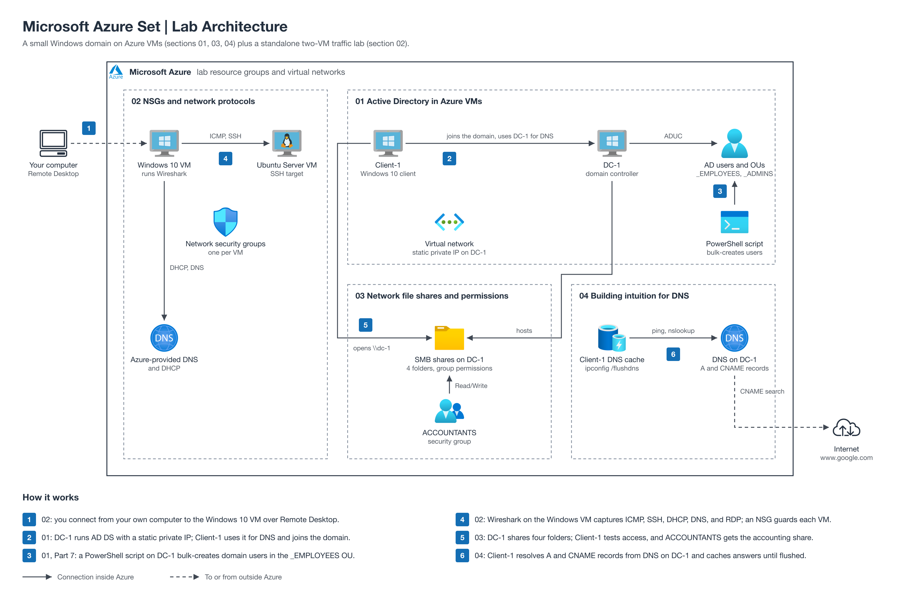

# Microsoft Azure Set

Hands-on Azure labs that build a small Windows domain in the cloud, then use it to explore network traffic, file share permissions, and DNS. Each section is a step-by-step follow-along guide.

The diagram shows how the four labs fit together: the shared DC-1 and Client-1 domain used by sections 01, 03, and 04, and the standalone two-VM traffic lab in section 02.

| Section | What you'll build | Folder |
| --- | --- | --- |
| Configuring On-premises Active Directory within Azure VMs | A Windows Server domain controller (DC-1) and a domain-joined Windows 10 client (Client-1) in Azure | [01-active-directory-in-azure-vms](./01-active-directory-in-azure-vms/) |
| Configure-On-Premise-AD-Powershell-Script-Users | A PowerShell script that bulk-creates AD users (Part 7 of the AD lab) | [01-active-directory-in-azure-vms, Part 7](./01-active-directory-in-azure-vms/README.md#part-7-create-users-with-powershell) |
| Network Security Groups (NSGs) and Inspecting Network Protocols | Two VMs behind NSGs, with Wireshark captures of ICMP, SSH, DHCP, DNS, and RDP | [02-nsgs-and-network-protocols](./02-nsgs-and-network-protocols/) |
| Network File Shares and Permissions | Shared folders on DC-1 with per-group permissions and a security group for access | [03-network-file-shares-and-permissions](./03-network-file-shares-and-permissions/) |
| Building Intuition for DNS | A and CNAME records on DC-1, resolved from Client-1, plus DNS cache behavior | [04-building-intuition-for-dns](./04-building-intuition-for-dns/) |

## How to use

Start with section 01. Sections 03 and 04 reuse its DC-1 and Client-1 VMs, so keep them running until you finish those labs. Section 02 stands on its own. Delete the Azure resource group when you're done to stop charges.

## License

Code and scripts in this repository are licensed under the MIT License (see [LICENSE](LICENSE)). Written guides and diagrams are licensed under [CC BY 4.0](https://creativecommons.org/licenses/by/4.0/). Third-party material keeps its original license and is excluded from both.
